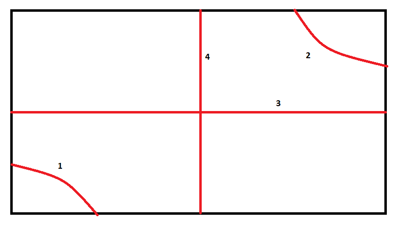

# Union Find

Questões solucionadas:

1. [União de círculos](#artwork)

Códigos auxiliares:

- [Union find](unionfind.cpp)

## Artwork

Questão: https://codeforces.com/gym/102346/problem/A

Complexidade: O(K)

Caso não seja familiarizado com a estrutura de dados union find (conhecida também como dsu), este [site](https://cp-algorithms.com/data_structures/disjoint_set_union.html) pode servir como uma boa referência.

Esse problema pede para que, dada uma área retangular de lados n e m, você responda se existe um caminho do ponto (0, 0) até o ponto (m, n) sem passar por dentro ou na borda da área dos sensores circulares dados.

Podemos separar o problema em 4 subproblemas, ilustrados abaixo:




Para que seja **impossível** sair do canto inferior esquerdo e chegar no canto superior direito pelo menos uma dessas 4 tipos de obstruções deve ocorrer. Podemos verificar isto realizando a união dos sensores circulares e verificar se há uma ligação entre as paredes em cada tipo de obstrução.

### Solução

Antes de considerar problema de fato, é necessário saber quando há a interseção entre dois círculos.

Sejam xi, yi, ri as posições no eixo x e y e o raio do círculo i, respectivamente. Então temos que há interseção entre os círculos i e j se, e somente se,

```
dist(i, j) <= ri + rj
```
Como no cálculo da distância nós temos uma raiz quadrada, podemos utilizar o quadrado da distância para evitarmos a utilização de números em ponto flutuante. Então o código fica assim:


```c++
bool intersecao(int x1, int y1, int r1, int x2, int y2, int r2) {

    // Para evitar ponto flutuante calculamos o quadrado da distância
    // e o quadrado da soma dos raios
    int dist_quadrado = (x1 - x2)*(x1 - x2) + (y1 - y2)*(y1 - y2);
    int raios_quadrado = (r1+r2)*(r1+r2);

    if(dist_quadrado <= raios_quadrado)
      return true;

    return false;
}
```

O armazenamento das informações dos sensores se dará através de tuplas cujas informações são a posição em x e y, e o raio, respectivamente. Cada sensor será indexado começando em 0 para podermos aplicar o código do union find.

```c++
vector<tuple<int,int,int>> sensores;

for(int i = 0; i < k; i++) {
  scanf("%d %d %d", &x, &y, &r);
  tuple<int,int,int> sensor = mt(x, y, r);
  sensores.pb(sensor);
  make_set(i);
}
```

Temos, então, que fazer duas coisas:

1. Realizar a união dos sensores cujas áreas se interceptam
2. Realizar a união dos sensores com as paredes, para então verificar união entre determinadas paredes.

Como o valor máximo de k (quantidade de sensores) é 10³, podemos fazer a união dos sensores em O(k²) sem problemas:

```c++
for(int i = 0; i < k; i++) {
  for(int j = 0; j < k; j++) {
    if(i != j) {                     // excluimos caso trivial
      tie(x1, y1, r1) = sensores[i];
      tie(x2, y2, r2) = sensores[j];
      if(intersecao(x1, y1, r1, x2, y2, r2))
        union_sets(i, j);
    }
  }
}
```

Já a união dos sensores com as paredes pode ser feita de forma simples em O(k):

```c++
// Criar referência para as paredes
// -1 e -2 são as paredes de baixo e de cima,
// -3 e -4 são as paredes da esquerda e direita
make_set(-1);  make_set(-2);  make_set(-3);  make_set(-4);

for(int i = 0; i < k; i++) {
  tie(x1, y1, r1) = sensores[i];
  if(y1-r1 <= 0) // parede de baixo
    union_sets(-1, i);

  if(y1+r1 >= n) // parede de cima
    union_sets(-2, i);

  if(x1-r1 <= 0) // parede da esquerda
    union_sets(-3, i);

  if(x1+r1 >= m) // parede da direita
    union_sets(-4, i);
}
```

Por fim devemos apenas dar print dependendo do resultado

```c++
if( (find_set(-1) == find_set(-2)) or (find_set(-3) == find_set(-4))
or  (find_set(-1) == find_set(-3)) or (find_set(-2) == find_set(-4))
    )
  cout << "N\n";
else
  cout << "S\n";
```


### Solução Completa

```c++
int parent[10000];
int size[10000];

bool intersecao(int x1, int y1, int r1, int x2, int y2, int r2) {

    // Para evitar ponto flutuante calculamos o quadrado da distância
    // e o quadrado da soma dos raios
    int dist_quadrado = (x1 - x2)*(x1 - x2) + (y1 - y2)*(y1 - y2);
    int raios_quadrado = (r1+r2)*(r1+r2);

    if(dist_quadrado <= raios_quadrado)
      return true;

    return false;
}

int main() {
  int m, n, k, x, y, r, x1, x2, y1, y2, r1, r2;
  scanf("%d %d %d", &m, &n, &k);

  vector<tuple<int,int,int>> sensores;

  for(int i = 0; i < k; i++) {
    scanf("%d %d %d", &x, &y, &r);
    tuple<int,int,int> sensor = mt(x, y, r);
    sensores.pb(sensor);
    make_set(i);
  }

  for(int i = 0; i < k; i++) {
    for(int j = 0; j < k; j++) {
      if(i != j) {                    // excluimos caso trivial
        tie(x1, y1, r1) = sensores[i];
        tie(x2, y2, r2) = sensores[j];
        if(intersecao(x1, y1, r1, x2, y2, r2))
          union_sets(i, j);
      }
    }
  }

  make_set(-1);  make_set(-2);  make_set(-3);  make_set(-4);

  for(int i = 0; i < k; i++) {
    tie(x1, y1, r1) = sensores[i];
    if(y1-r1 <= 0) // parede de baixo
      union_sets(-1, i);

    if(y1+r1 >= n) // parede de cima
      union_sets(-2, i);

    if(x1-r1 <= 0) // parede da esquerda
      union_sets(-3, i);

    if(x1+r1 >= m) // parede da direita
      union_sets(-4, i);
  }

  if((find_set(-1) == find_set(-2)) or (find_set(-3) == find_set(-4)) or (find_set(-1) == find_set(-3)) or (find_set(-2) == find_set(-4)))
    cout << "N\n";
  else
    cout << "S\n";

  return 0;
}

```
